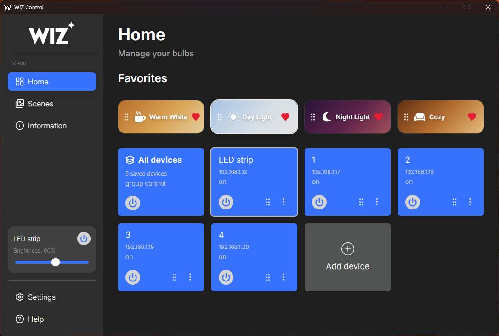
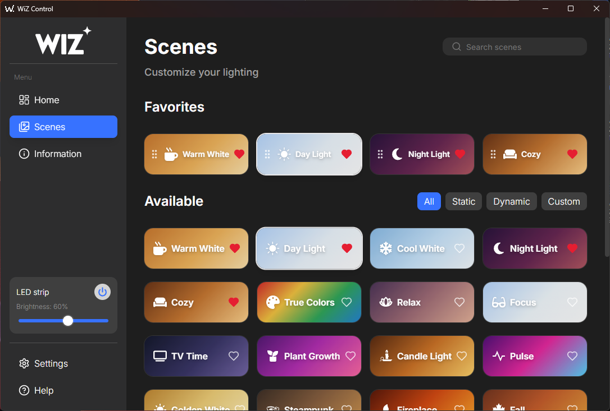
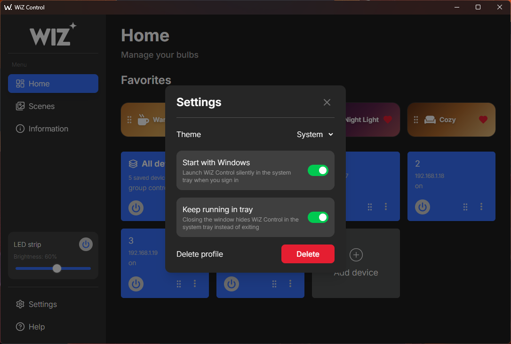
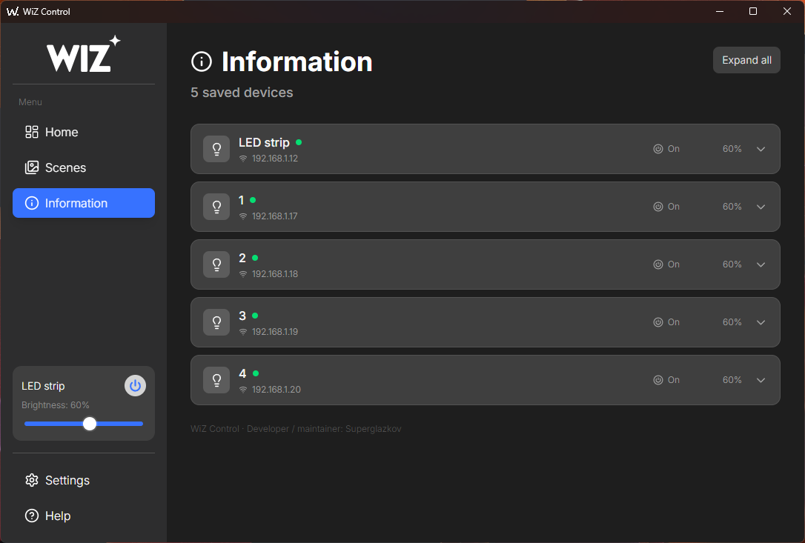
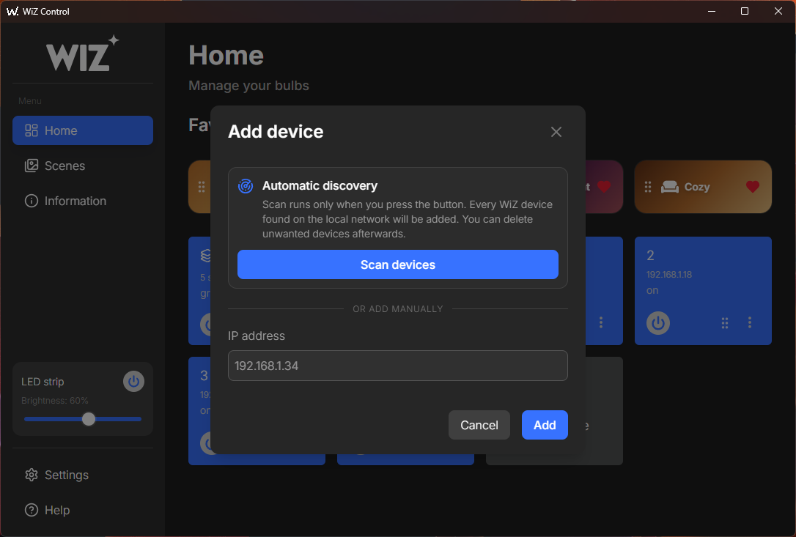

# WiZ Control


## Why WiZ Control?

WiZ Control is an open-source Windows desktop app for controlling Philips WiZ smart lights directly over the local network.

It supports multiple WiZ bulbs and light strips, All devices group control, scenes, LAN discovery, tray mode, device ordering and MAC-based IP recovery.

No cloud account is required for local device control.

## Download

Download the latest Windows installer from:

**[GitHub Releases](https://github.com/superglazkov/WiZ-Control/releases/latest)**

For the current release, run:

```text
WiZ-Control-<version vX.Y.Z>-Setup.exe
```

## Screenshots

### Home



### Scenes



### Settings



### Information



### Device management


